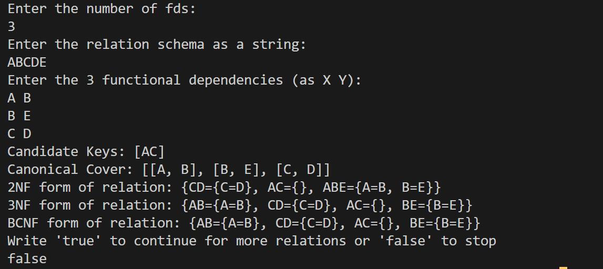

# Normalizer

This Java program implements a database normalizer that can analyze and convert relational schemas into various normal forms.

## Main Components

1. **Main.java**: The entry point of the program. It handles user input for the relation schema and functional dependencies, then creates a `Relation` object to perform normalization operations.

2. **Relation.java**: Defines the `Relation` class, which encapsulates the core functionality of the normalizer. It uses other utility classes to perform various calculations and checks.

3. **Calculators.java**: Contains static methods for calculating candidate keys, super keys, and canonical cover.

4. **Checkers.java**: Provides static methods to check if a relation is in 2NF, 3NF, or BCNF.

5. **Converters.java**: Implements static methods to convert relations into 2NF, 3NF, and BCNF.

6. **Helpers.java**: Contains utility methods for relation string manipulation used throughout the program.

## Key Features

1. **Functional Dependency Analysis**: The program can process and store functional dependencies for a given relation.

2. **Key Calculation**: 
   - Calculates candidate keys and super keys

3. **Normal Form Checks**:
   - Checks if the relation is in 2NF, 3NF or BCNF

4. **Normalization Conversions**:
   - Converts the relation to 2NF, 3NF, or BCNF, each from the root relation.
   - I have used the synthesis algorithm for 3NF conversion

5. **Canonical Cover**: Calculates the canonical cover (minimal cover) of the functional dependencies.

## Usage

1. Run the `Main` class.
2. Enter the number of functional dependencies.
3. Input the relation schema as a string (e.g., "ABCD").
4. Enter each functional dependency in the format "determinant dependent" (e.g., "A B" means A → B, i.e B is functionally dependant on A).
5. The program will perform various normalization operations and display the results.
6. You can choose to continue with another relation or exit the program.
7. There are more attributes of a relation than being printed here. There are mentioned in the attributes of the class `Relation`, and can be accessed using a `getSomeAttribute()` method. These getters are auto-generated by the Lombok library.
8. Ensure that you are atleast invoking the method to calcualte candidate keys, if not, none of the functionality will work.

## Example

### Interpreting the output
In the relation string, you can see a key-value pair `ABE={A=B, B=E}`. This means a sub relation with attributes C and D, whose functional dependencies are A->B and B->E. 
`AC={}` means a relation AC, which has no functional dependencies. These relation are for loseless decompostion.

## Dependency

This program uses the Lombok library for getter and setter methods in the `Relation` class. Ensure that Lombok is properly set up in your development environment for the code to compile and run correctly.
### Setting up in vscode
Install the .jar file of Lombok: https://projectlombok.org/download
Open the folder in vscode. In left pane, expand the "Java Projects" menu.
Click the plus button, and add the path of installed lombok.jar file to "Referenced Libraries" section.